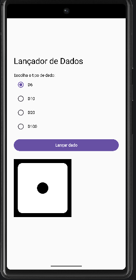

# README — Atividade Ponderada 1

## Aplicação: Lançador de Dados

Este projeto consiste na correção e expansão de uma aplicação Android desenvolvida em Kotlin utilizando Jetpack Compose. A proposta inicial fornecia apenas um dado do tipo D6, porém continha um erro lógico na geração dos valores aleatórios.

Além da correção do problema, foram implementados novos tipos de dados (D10, D20 e D100) e adicionadas imagens representando visualmente as faces do D6.

---

## Objetivo da Atividade

A atividade teve como principal objetivo desenvolver habilidades relacionadas à:

* execução e análise de um projeto Android;
* compreensão do funcionamento do Jetpack Compose;
* manipulação de estados com `remember` e `mutableStateOf`;
* identificação e correção de erros lógicos;
* utilização de estruturas condicionais com `when`;
* geração de números aleatórios em Kotlin;
* implementação de componentes visuais dinâmicos.

---

# Estrutura Inicial do Projeto

A aplicação inicial possuía:

* seleção de apenas um dado (`D6`);
* botão para realizar o lançamento;
* exibição textual do resultado.

O trecho responsável pela geração do valor do dado era:

```kotlin
"D6" -> Random.nextInt(6)
```

---

# Identificação do Erro Lógico

O problema da implementação original estava relacionado ao funcionamento da função:

```kotlin
Random.nextInt(6)
```

Em Kotlin, quando utilizado apenas um parâmetro, o método gera números no intervalo:

```text
0 até (valor - 1)
```

Assim, a aplicação retornava:

```text
0, 1, 2, 3, 4 e 5
```

Entretanto, um dado D6 deve gerar valores entre:

```text
1 e 6
```

Portanto, havia dois problemas:

* o número `0` era inválido;
* o número `6` nunca era sorteado.

---

# Correção da Lógica do D6

A solução implementada foi alterar a chamada da função para definir explicitamente o intervalo correto:

```kotlin
Random.nextInt(1, 7)
```

Nesse formato:

* o primeiro parâmetro representa o valor inicial inclusivo;
* o segundo parâmetro representa o valor final exclusivo.

Logo, os valores possíveis passaram a ser:

```text
1, 2, 3, 4, 5 e 6
```

Com isso, o comportamento do D6 foi corrigido corretamente.

---

# Expansão da Aplicação

Após a correção do D6, a aplicação foi expandida para suportar novos tipos de dados:

* D10
* D20
* D100

Inicialmente, a lista de dados possuía apenas:

```kotlin
val dados = listOf("D6")
```

Após a modificação:

```kotlin
val dados = listOf("D6", "D10", "D20", "D100")
```

Dessa forma, a interface passou a permitir a seleção de múltiplos tipos de dado utilizando `RadioButton`.

---

# Implementação das Novas Regras de Sorteio

A lógica foi reorganizada utilizando a estrutura condicional `when`, permitindo tratar individualmente cada tipo de dado.

## D10

```kotlin
Random.nextInt(1, 11)
```

Valores possíveis:

```text
1 até 10
```

---

## D20

```kotlin
Random.nextInt(1, 21)
```

Valores possíveis:

```text
1 até 20
```

---

## D100

```kotlin
Random.nextInt(1, 101)
```

Valores possíveis:

```text
1 até 100
```

---

# Adição de Imagens ao D6

Como desafio adicional da atividade, foi implementada a exibição visual das faces do dado D6.

Para isso:

* foram adicionados arquivos de imagem na pasta `drawable`;
* foi criado um estado para armazenar a imagem atual do dado:

```kotlin
var imagemDado by remember { mutableStateOf(R.drawable.dice_six_faces_one) }
```

Durante o sorteio do D6, o número gerado é utilizado para selecionar dinamicamente a imagem correspondente:

```kotlin
imagemDado = when (numero) {
    1 -> R.drawable.dice_six_faces_one
    2 -> R.drawable.dice_six_faces_two
    3 -> R.drawable.dice_six_faces_three
    4 -> R.drawable.dice_six_faces_four
    5 -> R.drawable.dice_six_faces_five
    else -> R.drawable.dice_six_faces_six
}
```

Posteriormente, a imagem é exibida na interface utilizando o componente:

```kotlin
Image(
    painter = painterResource(id = imagemDado),
    contentDescription = "Face do dado"
)
```

---

# Considerações Sobre Escalabilidade

A lógica utilizada para o D6 poderia ser aplicada também aos dados:

* D10
* D20
* D100

Entretanto, para isso seria necessário possuir assets gráficos correspondentes às faces desses dados.

Mesmo assim, a estrutura atual da aplicação já permite expansão futura sem necessidade de grandes alterações na lógica principal.

---

## Problema Encontrado Durante a Implementação das Imagens

Durante a etapa de implementação das imagens das faces do D6, ocorreu um erro de compilação relacionado aos arquivos adicionados na pasta `drawable`.

Inicialmente, algumas imagens possuíam o caractere `-` em seus nomes, por exemplo:

```text id="h0xv6w"
dice-1.png
dice-2.png
```

Entretanto, no Android, os arquivos presentes na pasta `res` seguem regras específicas de nomenclatura. Recursos utilizados pelo sistema Android não podem conter:

* letras maiúsculas;
* espaços;
* caracteres especiais;
* símbolos como `#`, `-` ou `@`.

Como consequência, o Android Studio apresentou erro de build durante a compilação do projeto, impedindo a execução da aplicação.

O problema foi resolvido renomeando os arquivos para um padrão compatível com o Android:

```text id="o0w1qq"
dice_six_faces_one.png
dice_six_faces_two.png
dice_six_faces_three.png
```
# Resultado Final

Ao final do desenvolvimento, a aplicação passou a:

* corrigir corretamente o sorteio do D6;
* permitir seleção entre D6, D10, D20 e D100;
* gerar valores válidos para cada dado;
* exibir visualmente as faces do D6;
* atualizar dinamicamente a interface após cada lançamento.

<p align="center">
  
</p>

<p align="center">
  
</p>

